#参赛设计说明书

————作品名称————

基于互联网大数据的事件智能抓取和画像

一、题目概述

1、1题目名称

基于互联网大数据的事件智能抓取和画像

1、2题目要求

随着互联网大数据的发展，各种大数据的分析对各行业都产生了不同程度的影响。网站数据、社交媒体数据等是互联网大数据的重要组成部分。对于民航业领域，社会事件的发生，会很大程度影响旅客的出行需求变化，从而影响航空公司飞机运力投放、航班编排、票价策略调整等，对互联网事件的准确抓取和分析能够帮助航空公司更好的服务市场、服务旅客、提升收益。
从互联网上抓取事件，并进行分词及语义等处理，提取事件的属性建立事件模型，以及可视化展现。

1、3题目背景

对于航空公司来说，能否预先判断旅客的出行需求，可用于航空公司及行业管理部门决定行业运力投放的合理性，从而提高旅客服务水平、提高航空公司航班收益水平。目前，仅靠航空公司拥有的数据是远远不够的，从互联网中获取大量的影响民航领域的信息能够帮助航空公司制定销售策略。而互联网事件数据，是其中非常重要的一种数据来源。
通过初步分析，对民航业可能有影响的事件主要可分为如下几类：政治会议（例G20）、展会、体育赛事、演唱会、突发异常天气等。对不同类型的事件分别分析，并建立一个相对统一的模型描述事件，用来分析其对旅客出行的影响。

1、4所需要解决的问题

（1）事件数据来源多；

（2）各数据源对事件的描述非常复杂，来自不同数据源的同一事件，可能差别较大；

（3）事件数据一般为非结构化数据，其处理和分析有一定的难度。

二、解题思路和算法

2、1解题思路

a.反爬策略

b.网站内容分析

c.数据存储

d.URL列表维护

e.内容去重

f.数据发布

2、2算法

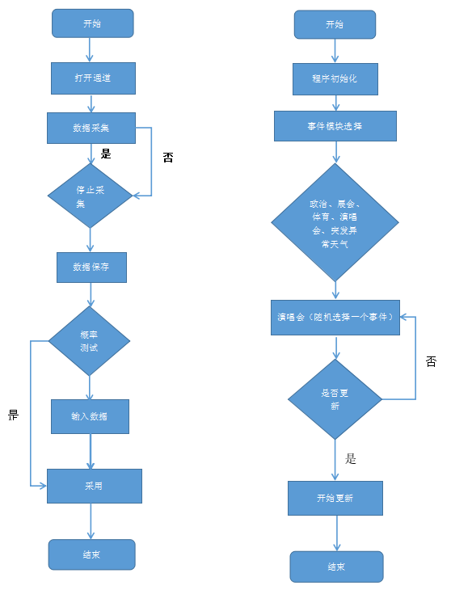
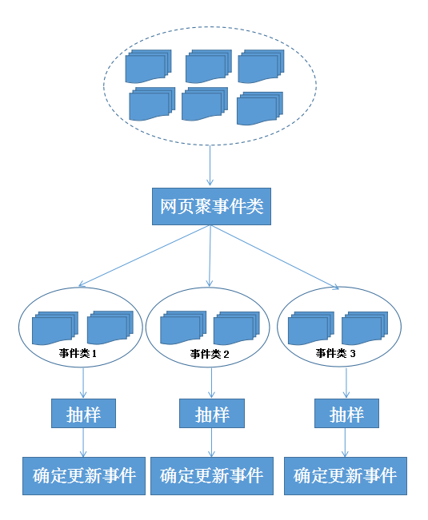
三、软件结构、模块、接口、功能

3、1结构

抓取系统需要面对的是整个互联网上数以亿计的网页,抓取系统往往是一个分式的三层结构：
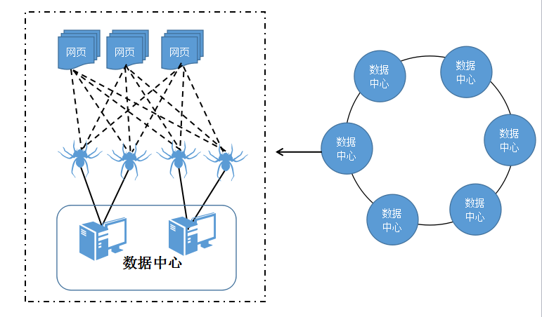

对于一个数据中心内的不同抓取服务器，协同工作有两种：

1、主从式：

主从式中有一台专门的Master服务器来维护待抓取URL队列，它负责每次将URL分发到不同的Slave服务器，而Slave服务器则负责实际的网页下载工作。Master服务器除了维护待抓取URL队列以及分发URL之外，还要负责调解各个Slave服务器的负载情况。以免某些Slave服务器过于清闲或者劳累。
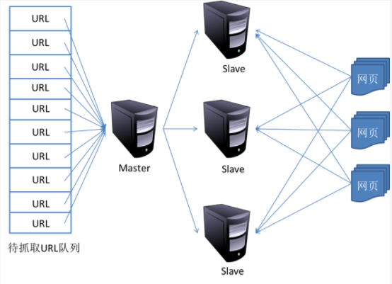

2、对等式：在这种方式上所有的抓取服务器都是相同的，每台抓取服务器都可以从待抓取在URL队列中获取URL，然后核对URL的主域名的hash值。
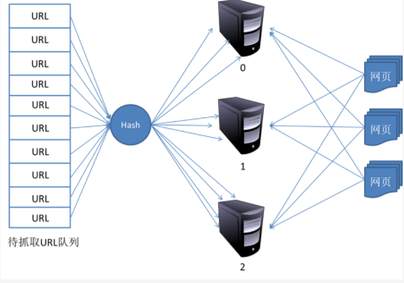

3、2模块

3、2、1初始种子集合模块

为网页分类服务的种子生成模块读入了既定格式的种子文件，把读到的种子格式化后持久化；该模块和数据处理模块的接口即为数据存储模块。

3、2、1爬行模块

本模块是在系统在各个网页爬行，爬取所需要的信息，比如政治、体育、演唱会等事件。
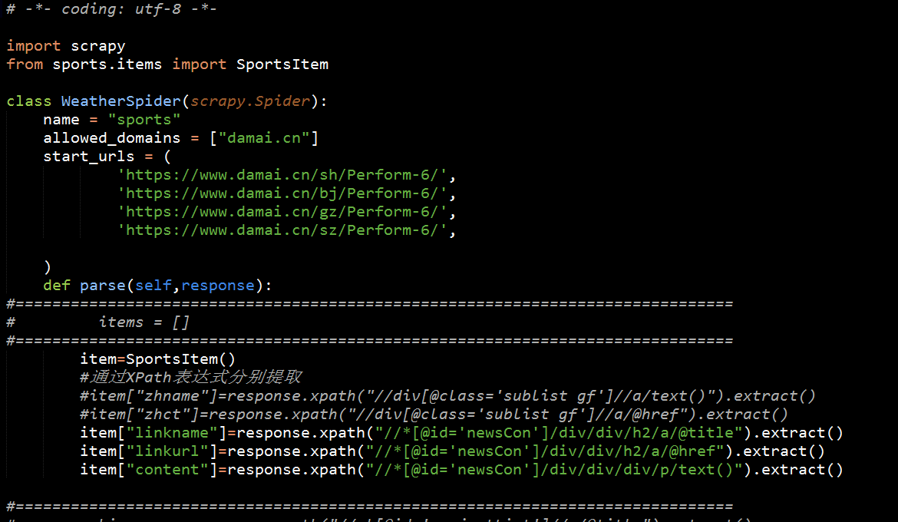

3、2、3内容分析模块

该模块是将所取得的内容进行分析，把当中出错的，不正确的内容找出来，并加以修改。修正后并将内容重新显示到网页中。
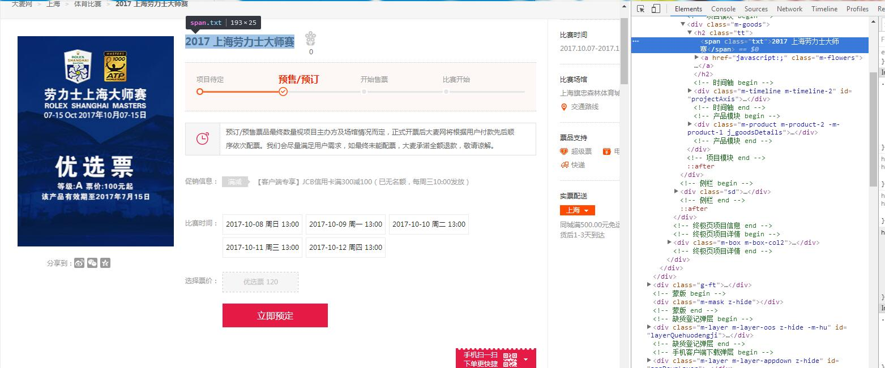

3、2、4数据处理模块

本模块将从网页上爬取到的数据进行处理，并将处理后的数据存入到相应的数据库中。
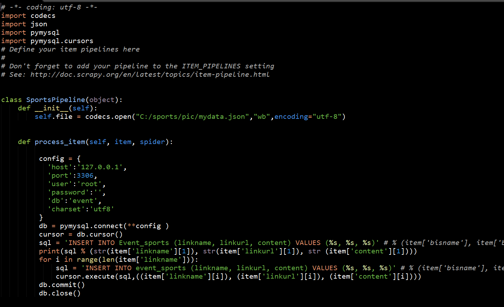
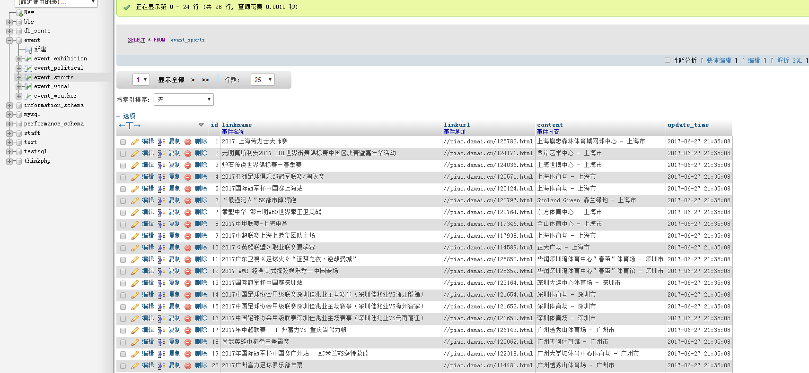

3、2、5数据抓取模块

在各个网页上对数据进行抓取。通过HTTP的链接按照网页的分类进行抓取。先读取，后分析过滤。
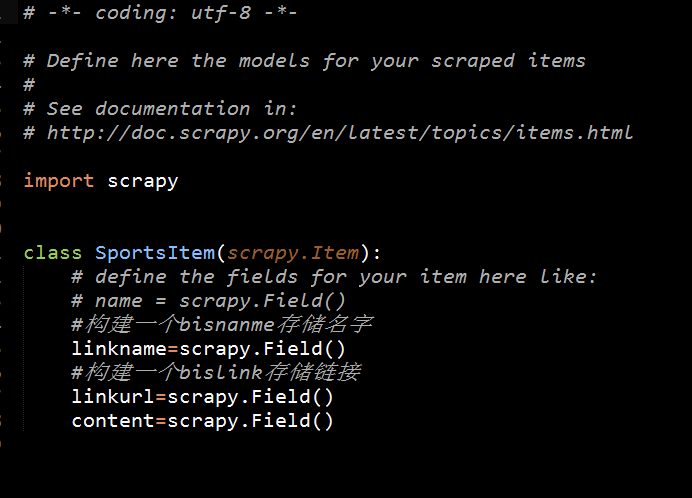

3、2、6数据存储模块

数据库名字：event；共有11张表，每张表存储的数据对应一个事件。
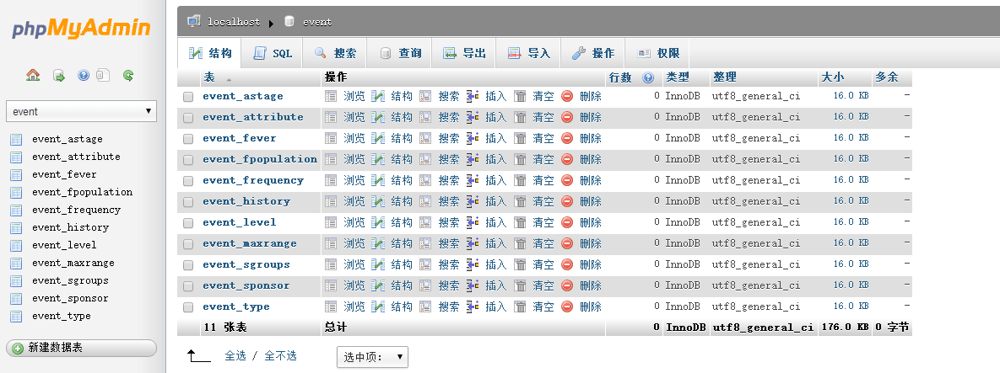
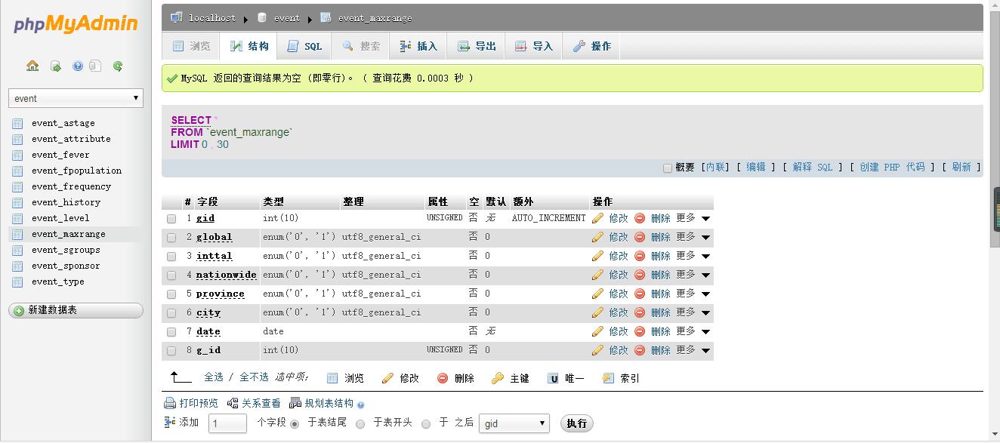

3、3接口

3、4功能

功能性需求：

（1）实现互联网事件天级或更高频次抓取，能够采集政治会议、展会、体育赛事、演唱会、突发异常天气等各类中比较主要的事件，每个类型的事件数据至少来自2个数据源（网站）。

（2）实现事件的去重功能，主要有两个方面，一是不同数据源（网站）的事件去重，二是不同天抓取的事件去重。

（3）事件画像建模，即事件属性自动化提取。属性需包括主办方级别、影响区域范围、影响力度、影响人群等。

非功能性需求：

（1）事件抓取频率：每天至少一次。

（2）事件应包括主要的影响力较大的事件，能涵盖指定时间段内主办方选取的事件为优。

（3）属性提取准确性高为优。

